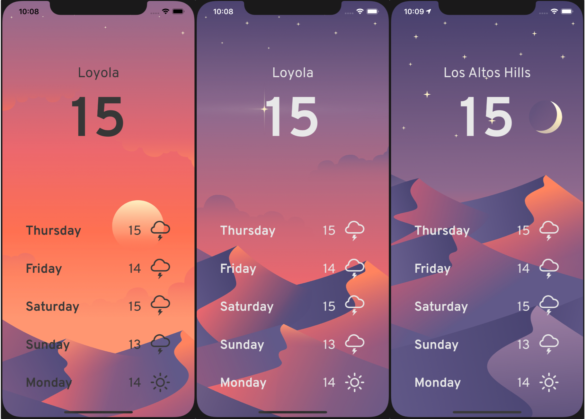

# Cloudy
> A simple weather app for iOS 13+.

[![Swift Version][swift-image]][swift-url]
[![License][license-image]][license-url]

Cloudy is an app which uses your location to deliver accurate weather and forecast using OpenWeatherMap's api.

## Features

- [x] AutoLayout
- [x] Dark Mode Enabled
- [x] Real-Time Data
- [x] Native Swift

## Requirements

- iOS 13.2+
- Xcode 11.3

## Installation
The app can be cloned to your local repository and ran on your device or a simulator using XCode.

#### Manually
1. Download/Clone project into XCode.
2. Run app sideloaded or on simulator.
2. Congratulations!  

## Contribute

I would love for you to contribute to **Cloudy**, check the ``LICENSE`` file for more info.

## Meta

Maximilian Harazin

Distributed under the MIT license. See ``LICENSE`` for more information.

[https://github.com/harazin/github-link](https://github.com/harazin/)

[swift-image]:https://img.shields.io/badge/swift-5.0-orange.svg
[swift-url]: https://swift.org/
[license-image]: https://img.shields.io/badge/License-MIT-blue.svg
[license-url]: LICENSE
[travis-image]: https://img.shields.io/travis/dbader/node-datadog-metrics/master.svg?style=flat-square
[travis-url]: https://travis-ci.org/dbader/node-datadog-metrics
[codebeat-image]: https://codebeat.co/badges/c19b47ea-2f9d-45df-8458-b2d952fe9dad
[codebeat-url]: https://codebeat.co/projects/github-com-vsouza-awesomeios-com
